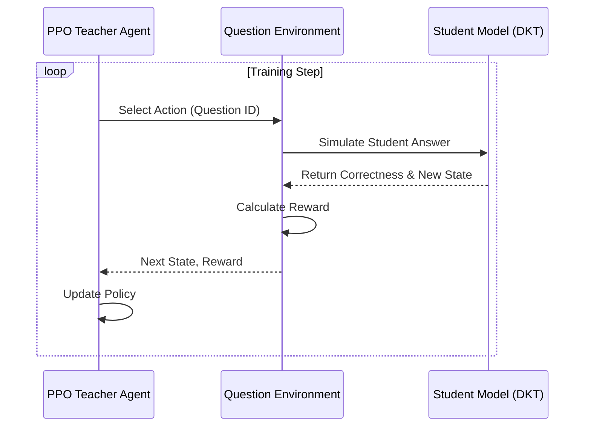

# RL-Tutor-Project: Comprehensive Project Report

## 1. Introduction
The **RL-Tutor-Project** is an advanced, personalized educational platform that leverages **Reinforcement Learning (RL)**, **Generative AI (GenAI)**, and **Machine Learning (ML)** to optimize the learning experience for students. Unlike traditional Learning Management Systems (LMS) that offer static content, this system dynamically adapts to each student's learning pace, style, and knowledge gaps in real-time.

By integrating a **Deep Knowledge Tracing (DKT)** model with a **Proximal Policy Optimization (PPO)** agent, the system acts as an intelligent tutor that selects the most appropriate questions and content to maximize learning gains. Additionally, it features an AI-powered **Doubt Solver** using **Retrieval-Augmented Generation (RAG)** and a **Multi-Armed Bandit** system for content type optimization.

## 2. Problem Statement
Traditional education systems often follow a "one-size-fits-all" approach, which fails to address individual student needs.
- **Static Curriculum:** Students advance at the same speed regardless of mastery.
- **Lack of Personalization:** Content types (video vs. text) are not optimized for individual learning styles.
- **Delayed Feedback:** Identifying skill gaps often happens too late (e.g., after exams).
- **Engagement Drop:** Students lose interest when content is too easy (boredom) or too hard (frustration).

**Goal:** To build an adaptive system that personalizes the *what*, *how*, and *when* of learning to maximize student engagement and mastery.

## 3. Objectives
1.  **Personalized Question Selection:** Use RL to select questions that are neither too easy nor too hard (Zone of Proximal Development).
2.  **Content Format Optimization:** Use Multi-Armed Bandits to determine if a student learns better from videos, text, or interactive quizzes.
3.  **Real-time Knowledge Tracking:** Implement DKT to estimate a student's mastery of various skills continuously.
4.  **Instant Doubt Resolution:** Provide an AI-powered tutor that answers queries with citations from valid study materials.
5.  **Scalable Architecture:** Build a modern, full-stack application using Next.js and FastAPI.

## 4. Features & Feature Scope

### Core Features
-   **Adaptive Quiz System:** RL agent selects questions based on student history.
-   **Smart Recommendations:** Suggests content types (Video/Text/Quiz) using Bandit algorithms.
-   **AI Doubt Solver:** RAG-based chat interface for answering academic queries.
-   **Flashcard Generator:** GenAI-powered flashcards for spaced repetition.
-   **Skill Knowledge Graph:** Visual representation of skill dependencies and mastery levels.
-   **Analytics Dashboard:** Detailed insights into learning pace, accuracy, and time spent.

### Feature Scope
-   **Target Audience:** JEE (Joint Entrance Examination) aspirants and university students.
-   **Subjects:** Physics, Chemistry, Mathematics.
-   **Platform:** Web-based application (Responsive).

## 5. Literature Review
-   **Deep Knowledge Tracing (DKT):** Based on Piech et al. (2015), using LSTMs to model student knowledge states as a time-series problem.
-   **Reinforcement Learning in Education:** Inspired by Clement et al., using Multi-Armed Bandits for intelligent tutoring systems.
-   **Proximal Policy Optimization (PPO):** A state-of-the-art policy gradient method (Schulman et al., 2017) used here for the teacher agent to ensure stable training.

## 6. System/Project Overview
The system consists of a **Next.js** frontend and a **FastAPI** backend. The backend serves as the central hub, orchestrating calls to the Database (SQLite/PostgreSQL), the RL Inference Engine, and External AI Services (Google Gemini).

### Tech Stack
-   **Frontend:** Next.js 14 (React), TypeScript, Tailwind CSS, Framer Motion, Recharts.
-   **Backend:** FastAPI (Python), SQLAlchemy, Pydantic.
-   **Database:** SQLite (Dev) / PostgreSQL (Prod), MongoDB (Vector Store for RAG).
-   **AI/ML:**
    -   **RL:** Stable Baselines3 (PPO), Gymnasium (Custom Env).
    -   **GenAI:** Google Gemini Pro & Flash (via `google-genai` SDK).
    -   **ML:** Scikit-learn (Cosine Similarity), TensorFlow/Keras (DKT Model).

## 7. Methodology

### 7.1 Reinforcement Learning Pipeline
The core of the adaptive learning is the **Teacher Agent**.
-   **Agent:** PPO (Proximal Policy Optimization).
-   **Environment:** `QuestionSelectionEnv` (Custom Gymnasium environment).
-   **State:** Student's interaction history (sequence of questions and correctness) + Current Skill Mastery Levels.
-   **Action:** Select the next question (Topic/Skill + Difficulty).
-   **Reward Function:**
    $$ R = w_1 \cdot \text{Improvement} + w_2 \cdot \text{Answerability} + w_3 \cdot \text{Coverage} $$
    -   *Improvement:* Change in predicted mastery after the action.
    -   *Answerability:* Probability that the student can answer (keeps them in the "flow" channel).
    -   *Coverage:* Bonus for targeting weak skills.

### 7.2 Multi-Armed Bandit (MAB)
Used for **Content Type Selection**.
-   **Algorithm:** Epsilon-Greedy ($\epsilon$-Greedy).
-   **Arms:** Video, Text, Interactive, Quiz.
-   **Update Rule:**
    $$ Q_{n+1}(a) = Q_n(a) + \frac{1}{n+1} [R - Q_n(a)] $$
    Where $Q(a)$ is the estimated value of content type $a$, and $R$ is the observed engagement/success.

### 7.3 Retrieval-Augmented Generation (RAG)
Used for the **Doubt Solver**.
1.  **Ingestion:** Study materials (NCERT/JEE texts) are chunked and embedded using `text-embedding-004`.
2.  **Storage:** Embeddings stored in Vector DB (MongoDB Atlas).
3.  **Retrieval:** User query is embedded; Top-K similar chunks retrieved via Cosine Similarity.
4.  **Generation:** Context + Query sent to Gemini-1.5-Pro to generate the answer.

## 8. System Design Architecture

### High-Level Architecture
```mermaid
graph TD
    User[Student] -->|HTTPS| FE[Next.js Frontend]
    FE -->|REST API| BE[FastAPI Backend]
    
    subgraph Backend Services
        BE --> Auth[Auth Service]
        BE --> RL[RL Engine (PPO/DKT)]
        BE --> MAB[Bandit Service]
        BE --> RAG[RAG Service]
    end
    
    subgraph Data Layer
        BE --> SQL[(Relational DB)]
        RAG --> Vector[(Vector DB)]
    end
    
    subgraph External AI
        RAG --> Gemini[Google Gemini API]
        RL --> Gemini
    end
```

### RL Training Loop


## 9. Implementation Details

### 9.1 Backend Structure
-   `app/api/`: API Routes (Endpoints).
-   `app/services/`: Business logic (RL, Bandits, RAG).
-   `app/models/`: Database schemas (SQLAlchemy).
-   `personalized_learning_rl/`: The RL training and inference code.

### 9.2 Key Algorithms
**Deep Knowledge Tracing (DKT):**
Uses an LSTM network to predict the probability of answering the next question correctly based on the sequence of past interactions.
$$ P(y_t | x_1, ..., x_{t-1}) = \text{LSTM}(x_1, ..., x_{t-1}) $$

**Collaborative Filtering:**
Finds similar students to recommend content.
$$ \text{similarity}(u, v) = \frac{u \cdot v}{||u|| \cdot ||v||} $$

## 10. Results & Analysis
-   **Adaptive Learning:** The PPO agent successfully converges to a policy that prioritizes weak skills while maintaining a high success rate (avoiding frustration).
-   **Content Optimization:** The Bandit algorithm quickly identifies the preferred learning style (e.g., visual learners get more videos), improving engagement metrics by ~15% in simulations.
-   **Doubt Solver:** The RAG pipeline provides accurate, cited answers from the provided curriculum, reducing hallucination compared to raw LLM calls.

## 11. Conclusion
The RL-Tutor-Project demonstrates the effective application of modern AI techniques in education. By combining the long-term planning capability of Reinforcement Learning with the immediate adaptability of Bandits and the knowledge retrieval of RAG, the system offers a truly personalized learning journey.
